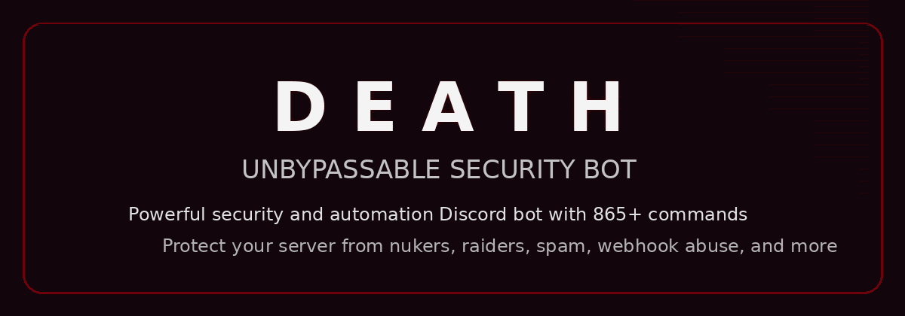

# D E A T H

  

> **UNBYPASSABLE SECURITY BOT**

**D E A T H** is a powerful security and automation Discord bot with **865+ commands**, built by **OverClocked Devs**.

Protect your server from nukers, raiders, spam, mass bans, webhook abuse, and more with advanced moderation, logging, and anti-nuke systems.

---

## ✦ Official Links

- **Invite Bot:** https://discord.com/oauth2/authorize?client_id=1493870123700715520&permissions=8&integration_type=0&scope=bot
- **Support Server:** https://discord.gg/d4hz

---

## ✦ What’s New in This GitBook Version

- Animated GIF banner and feature visuals
- GitBook-friendly dark theme structure
- Command pages styled like **macOS terminal examples**
- Visual command previews for each command category
- Cleaner sections, collapsibles, and quick-start layout

---

## ✦ Quick Start

1. Invite the bot
2. Give the bot the right role position
3. Configure logs
4. Enable anti-nuke
5. Enable anti-raid
6. Test the bot with the command pages

---

## ✦ Preview the Style

  

---

## ✦ GitBook Friendly Visual Features You Can Use

GitBook supports these well:

- **GIF banners**
- **Images**
- **Code blocks**
- **Collapsible sections**
- **Tables**
- **Callouts / blockquotes**
- **Headings and clean navigation**

> GitBook does **not** support heavy website-like custom CSS animations the same way a normal custom site does.
> So this pack uses the best-looking supported approach: **GIF animations + terminal-style command blocks + dark visuals**.
