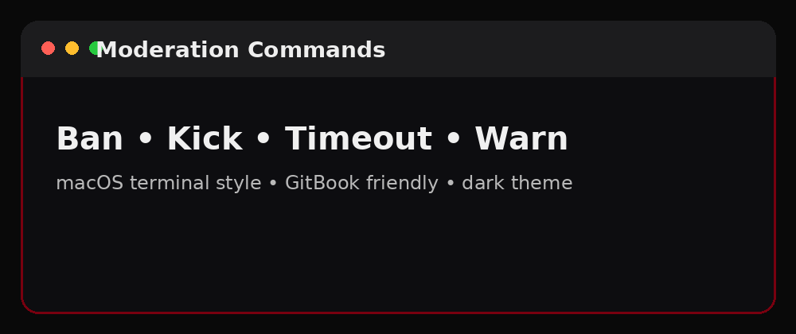

# Moderation Commands

<p align="center">
  
</p>

## macOS Terminal Style

**Terminal — Moderation**

```bash
>ban @user reason
>kick @user reason
>timeout @user 10m reason
>untimeout @user
>warn @user reason
>warnings @user
>clear 10
>lock
>unlock
```

## Common Moderation Commands

| Command | Purpose |
|---|---|
| `>ban @user reason` | Ban a member |
| `>kick @user reason` | Kick a member |
| `>timeout @user 10m reason` | Timeout a user |
| `>untimeout @user` | Remove timeout |
| `>warn @user reason` | Warn a user |
| `>warnings @user` | View warnings |
| `>clear 10` | Delete messages |
| `>lock` | Lock a channel |
| `>unlock` | Unlock a channel |
