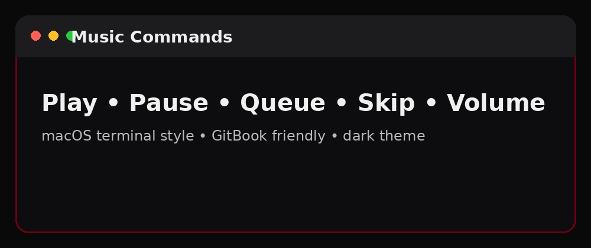

# Music Commands

<p align="center">
  
</p>

## macOS Terminal Style

**Terminal — Music**

```bash
>play song name
>pause
>resume
>skip
>stop
>queue
>nowplaying
>volume 50
>loop
```

## Common Music Commands

| Command | Purpose |
|---|---|
| `>play song name` | Play a track |
| `>pause` | Pause playback |
| `>resume` | Resume playback |
| `>skip` | Skip current track |
| `>stop` | Stop playback |
| `>queue` | Show queue |
| `>nowplaying` | Show current song |
| `>volume 50` | Set volume |
| `>loop` | Loop track or queue |

> Music availability depends on your hosting/audio backend.
