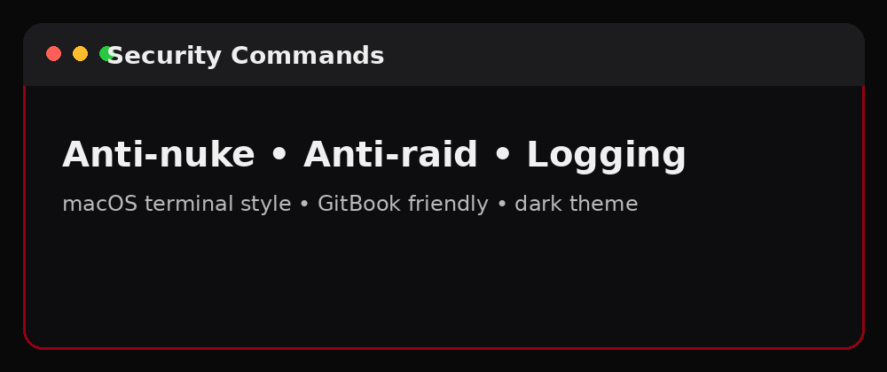

# Security Commands

<p align="center">
  
</p>

## macOS Terminal Style

**Terminal — Security Setup**

```bash
>help security
>antinuke enable
>antinuke punishment quarantine
>antiraid enable
>automod links on
>automod spam on
>logs set security #security-alerts
```

## Common Security Commands

| Command | Purpose |
|---|---|
| `>help security` | Show security help |
| `>antinuke enable` | Enable anti-nuke |
| `>antinuke punishment quarantine` | Set punishment |
| `>antiraid enable` | Enable anti-raid |
| `>automod links on` | Block malicious links |
| `>automod spam on` | Enable anti-spam |
| `>logs set security #channel` | Set security log channel |

<details>
<summary><strong>Copy-ready block</strong></summary>

```bash
>antinuke enable
>antiraid enable
>automod spam on
>automod links on
>logs set security #security-alerts
```

</details>
