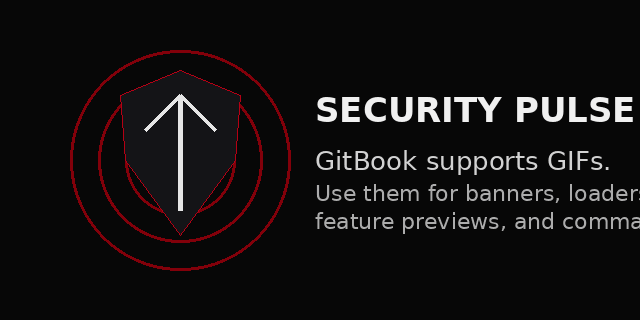

# Security Overview

  

D E A T H is built to protect Discord communities from destructive actions and automated attacks.

## Protection Layers

| Layer | Purpose |
|---|---|
| Anti-Nuke | Stops destructive admin abuse |
| Anti-Raid | Detects mass joins and raid waves |
| Anti-Spam | Blocks chat spam and message flood |
| Webhook Protection | Stops malicious webhook usage |
| Logging | Tracks dangerous actions and server events |

> **Trust carefully. Log everything. Protect instantly.**
